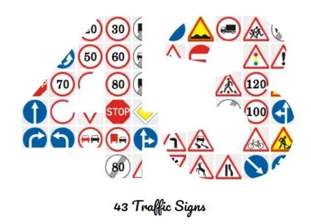

# German Traffic Signs Recognition for Autonomous Driving



## Introduction
Recognition of traffic signs is an essential requirement to deploy fully autonomous vehicles in the real world. The detection and classification of the traffic signs are recognized before planning a motion trajectory because it is necessary to avoid dangerous collisions.  While autonomous driving on highways has made a lot of progress in recent years, inner city driving remains an unsolved problem. In the field of autonomous driving environmental objects like pedestrians, cars, and trucks play a crucial role to develop fully autonomous cars. In the current research detection and tracking algorithms for environmental objects provide good results but in crossway and traffic-congested areas, only recognition of an environmental object is not enough. we must depend on other infrastructure like traffic signs (speed limits, right or left turns, and so on). Motivated by this research problem recognition of traffic signs is a key component to ensure road safety. The traffic signs reorganization is an important task to be studied for L4 autonomous driving. If an autonomous system fails to recognize traffic signs correctly, an accident might happen. Therefore, accurate traffic sign recognition, path planning, and decision-making modules are very important steps to developing robust and safe AD and ADAS functionalities for urban driving.The objective of the project is to develop a pipeline for deep leaning based traffic signs classification for autonomous driving.


## Install and Run the Project
  * Install all dependencies from *requirements.txt* file and use anaconda environment.
  * For example:
  ```
      conda create -n GTR
      conda activate GTR
      cd ${Traffic_sign_classification_ROOT}
      pip install -r requirements.txt
   ```
  
  
## Project file description
  *  *main.py* file for general CNN architecture
  *  *nas.py* file for neural architecture search method

## Download the dataset
  * clone this repository to download the data *!git clone https://bitbucket.org/jadslim/german-traffic-signs*
  * In which, we can see four directory.
    ```
     train.p   #training data
     test.p    #testing data
     valid.p   #validation data
     signnames   #groudtruth
    ```
     
## Acknowledgement
Thanks for the support during project. [University Siegen ISG](https://isg.beel.org/)
